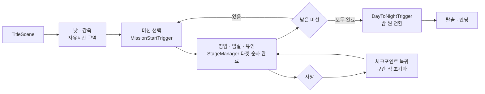
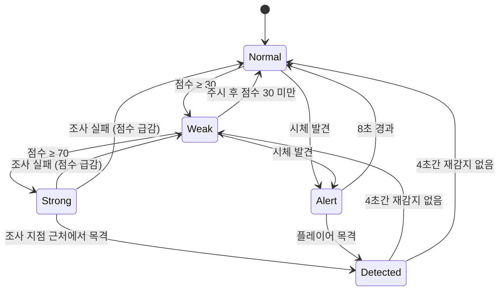
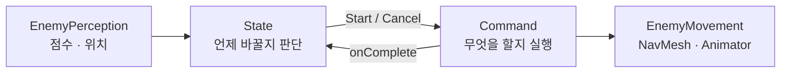

<div align="center">

# StealthActionGame

**교도관의 시야와 소리를 피해 잠입 · 암살 · 유인으로 탈출하는 Unity 3D 스텔스 액션**


</div>

<br/>

## 📌 프로젝트 개요

| 항목 | 내용 |
|---|---|
| **장르** | 3인칭 스텔스 액션 |
| **엔진** | Unity 6000.x (C#) |
| **개발 기간** | 2026.09.xx ~ 2026.09.xx (2주) |
| **개발 인원** | N인 팀 프로젝트 |
| **담당 파트** | 적 AI 전반 (감지 · 상태 판단 · 행동 · 전투) 및 플레이어 시스템 연동 |
| **플랫폼** | PC (Windows) |
| **기술개발서** | 슬라이드 기반 Enemy AI 기술개발서 별도 제작 |

감옥을 배경으로, 플레이어는 교도관의 **시야와 소리**를 피해 미션을 수행하고 탈출합니다. 스텔스 게임의 재미는 **"적을 읽고 속이는 것"** 에 있다고 보고, 플레이어가 **반응을 예측하고 역이용할 수 있는 적 AI**를 목표로 설계했습니다.

<br/>

## 👥 팀 구성

| 이름 | 담당 |
|---|---|
| **김종찬** | 적 AI (감지 · 상태 · 행동 · 전투), 암살 · 체크포인트 · 경보 연동, NPC 대화 연동, 환경 라이팅 |
| 팀원 | (담당 파트) |
| 팀원 | (담당 파트) |

<br/>

## 🎮 조작법

| 입력 | 동작 |
|---|---|
| `W` `A` `S` `D` | 이동 |
| `마우스` | 시점 회전 |
| `Left Shift` 홀드 | 달리기 (발소리 커짐) |
| `Space` | 점프 |
| `C` | 앉기 토글 (시야 · 발소리 감소) |
| `E` | 상호작용 · 암살 · 시체 들기/내려놓기 |
| `마우스 좌클릭` 홀드 → 떼기 | 병 던지기 (궤적 표시) |
| `Q` 홀드 | 투시 (적 위치 확인) |
| `ESC` | 일시정지 · 설정 |

<br/>

## 🔄 게임 흐름



<div align="center">

<br/><sub>적의 감시를 피해 미션 타겟을 순서대로 완료하고 다음 구역으로 진행</sub>
</div>

<br/>

## ⚙️ 핵심 시스템 (담당 파트 : Enemy AI)

### 01. State × Command 기반 적 AI 구조 · `EnemyStateMachine`


행동이 늘어날수록 상태 클래스마다 이동 · 두리번 · 확인 코드가 반복되는 문제를 막기 위해 **상태 패턴과 커맨드 패턴을 조합**했습니다.

- **State**(`Normal` · `Weak` · `Strong` · `Detected` · `Alert`)는 **"언제 바꿀지"** 만 판단
- **Command**(`LookAround` · `Investigate` · `Chase` · `Attack`)는 **"무엇을 할지"** 만 실행, 모든 행동을 `Start` · `Tick` · `Cancel` 수명주기로 통일
- `LookAroundCommand` 하나를 순찰 유휴 · 의심 주시 · 조사 확인 · 시체 경계 **4곳에서 재사용**, 상태를 빠져나갈 때 `Cancel()` 한 줄로 정리
- 적은 플레이어 클래스를 직접 모르고 `IDetectable` / `IDamageable` 인터페이스로만 연결 → 더미 오브젝트만으로 단독 테스트

<br/>

### 02. 의심 점수 기반 감지 · `EnemyPerception.cs`

<table>
<tr>
<td></td>
<td></td>
</tr>
</table>

보이는 순간 발견되는 불공정함을 없애기 위해 **0~100 의심 점수를 누적**하는 방식으로 설계했습니다.

- 거리 구간별 초당 증가량(근거리 30 · 중거리 10 · 원거리 3)에 **앉기(×0.5) · 은신 가중치를 곱셈**으로 적용
- 점수 30 이상 약한 의심 `?`, 70 이상 강한 의심 `?`(펄스), 발견 시 `!` — DOTween 기반 머리 위 인디케이터
- 근접 즉시감지는 **1.5m · 전방 270° · 완전 노출**일 때만 발동, 등 뒤 90°는 암살 접근을 위해 사각으로 유지
- 시야 차단 판정은 `RaycastAll` 후 타겟 근처 히트를 무시해 자기 콜라이더 오탐 방지
- 시야에서 벗어나면 점수 감쇠, 앉아서 숨으면 감쇠 속도 ×4

<br/>

### 03. 청각 & 소리 유인 · `RegisterSound()`

<table>
<tr>
<td></td>
<td></td>
</tr>
</table>

발소리 · 던진 병 · 경보기가 각자 다른 방식으로 전달되면 소리원이 늘 때마다 적 코드를 고쳐야 하므로, **`RegisterSound(위치, 강도, 돌발, 반경, 환경음)` 단일 API**로 통일했습니다.

- 거리 감쇠 · 기억 · 점수화는 모두 `EnemyPerception` 내부에서 처리 → 새 소리원은 호출 한 줄
- 잠금 시간 동안은 **더 센 소리만** 위치를 갱신해, 약한 소리가 강한 소리 위치를 덮어쓰지 않도록 처리
- 강한 의심 이상 세기의 돌발 소리는 **즉시 만점** → 병 던지기 유인이 확실히 통하도록 보장
- `ThrownObjectSound`는 **실제로 던졌을 때만 무장**, 손에 든 상태 · 그냥 내려놓기 · 씬 시작 낙하는 무시

<br/>

### 04. 5단계 상태 전이 · `States/`



| 상태 | 플레이어가 보는 신호 | 설계 의도 |
|---|---|---|
| **Normal** | 없음 | 확률적 두리번으로 순찰 패턴 암기를 어렵게, 고정 경비는 처음 감시 방향 유지 |
| **Weak** | 주황 `?` | 주시가 끝날 때까지 **강등 보류** → "들킬 뻔했다"는 피드백을 최소 한 번은 보여줌 |
| **Strong** | 빨강 `?` | 시야/소리 중 우세한 쪽 위치로 조사 → 적이 **어디를 의심하는지** 움직임으로 노출 |
| **Detected** | 빨강 `!` | 실시간 추적 + 공격, **암살 불가** → 정면으로 들킨 뒤의 긴장 유지 |
| **Alert** | 빨강 `?` | 시체 방향 경계 → 암살에 "흔적"이라는 대가를 부여 |

<br/>

### 05. 조사 · 추적 · 공격 · `Commands/`

<table>
<tr>
<td></td>
<td></td>
</tr>
</table>

- **조사 지점 기준 발견** — 조사하러 가는 도중 멀리서 보이기만 해도 발견되면 유인 전략이 무력화되므로, **조사 지점 반경 안에서 보일 때만** 발견 처리
- **추적 불가 판정** — "보인다"와 "갈 수 있다"를 분리해 `IsReachable()`로 경로를 따로 검사. 막혔지만 보이면 경계 유지, 막히고 안 보이면 즉시 포기
- **3단계 공격** — `Windup(0.4s) → Hit → Recovery(0.6s)`로 예고 동작을 둬 회피 여지 확보. 공격 중엔 이동 애니메이션을 고정하고 NavMesh 자동 회전을 끄고 직접 보간

<br/>

### 06. 시체 발견 & 자유시간 구역 · `AlertState` / `PrisonScheduleManager`

<table>
<tr>
<td></td>
<td></td>
</tr>
</table>

- **시체 발견** — 시체 레이어를 감지하면 `Alert` 상태로 전환, 같은 시체에는 `HashSet` 기록으로 **한 번만 반응**해 무한 경계 반복 방지
- **자유시간 구역** — 스케줄 이벤트를 구독해 자유시간엔 감지를 멈추고, 의심 행동은 **경고음 + 점수 급감으로 흡수하다 2회 누적 시 발견**
- 방을 지키는 교도관은 `isAlwaysAlert`로 예외, 경보기 소리는 개인 도발이 아닌 **환경음**으로 보고 자유시간에도 항상 조사

<br/>

### 07. 암살 판정 통합 · `AssassinationSystem.CanTarget()`


"Kill" UI가 떴는데 암살이 안 되거나, UI 없이 암살되는 불일치를 해결하기 위해 **판정을 한 곳으로 모았습니다.**

- 거리 + 각도 + `EnemyAI.CanBeAssassinated`를 `CanTarget()` 하나에서 판정
- 실제 암살 실행(`FindVictim()`)과 UI 표시(`EnemyObject.IsInteractable`)가 **모두 이 메서드만 참조**
- UI는 `OnTargetAcquired` / `OnTargetLost` / `OnTakedownStarted` 이벤트 구독으로만 표시 · 숨김
- 발견 상태에서는 `IsAssassinable = false` → 정면 전투 중 암살로 빠져나가는 것 방지

<br/>

### 08. 사망 & 체크포인트 복귀 · `EnemySegment`


- **사망** — `PlayerDeath`가 플레이어 감지를 차단(`IsDeadOrRespawning`)하고 모든 적에 `ForceForgetPlayer()` → 쓰러진 플레이어를 계속 쫓던 문제 해결
- **체크포인트** — 씬 전체를 다시 불러오지 않고, `EnemySegment`가 **해당 구간의 적만** `ReviveForCheckpoint()`로 스폰 위치 · 방향 · Normal 상태로 복원

<br/>

### 09. NPC 대화 & 자막 · `NPCInteractionObject` / `SubtitleTrigger`


- 자막 재생 책임을 공용 컴포넌트 `SubtitleTrigger`로 분리 → NPC뿐 아니라 모든 상호작용 오브젝트에서 재사용
- 대화 중엔 플레이어를 바라보고, 끝나면 **원래 바라보던 방향으로 복귀**
- 상호작용 설명 UI를 `Object_Data`(ScriptableObject)로 오브젝트마다 교체, `uiAnchor`로 표시 위치 지정
- 대화는 상체 전용 상호작용으로 처리해 **대화 중에도 플레이어 이동 가능**

<br/>

### 10. 연출 · Idle 모션 랜덤화 / 스카이박스

<table>
<tr>
<td></td>
<td></td>
</tr>
</table>

- 이동 블렌드 트리의 대기 슬롯에 **Idle 서브 블렌드 트리**를 중첩하고 `IdleIndex`로 랜덤 선택
- 두리번 행동은 **Idle 루프 경계(시작/끝 5%)에서만 시작**해 모션이 중간에 끊기지 않도록 처리, 회전 중엔 기본 Idle로 고정
- `SkyboxRandomizer`로 낮 씬 시작 시 스카이박스를 랜덤 적용 (`Awake`에서 적용해 첫 프레임 깜빡임 방지)
- 환경광 소스를 스카이박스와 분리해 **실내(감옥) 조명이 하늘 색에 영향받지 않도록** 설정

<br/>

## 🏗️ 설계 포인트 : "언제"와 "무엇을"의 분리

초기에는 상태 클래스 안에서 이동 · 두리번 · 조사 · 복귀를 모두 직접 처리했습니다. 기능이 늘어날수록 같은 두리번 코드가 여러 상태에 복사되고, 상태를 빠져나갈 때 진행 중이던 트윈이나 회전을 정리하는 코드가 흩어졌습니다.

이를 **상태(전이 판단) + 커맨드(행동 실행)** 구조로 나눴습니다.



- 상태 전환은 `ChangeState()` 한 곳으로만, 암살 가능 여부는 전환마다 기본값으로 리셋하고 필요한 상태만 덮어씀
- 행동은 `Start(fsm, onComplete)` / `Tick()` / `Cancel()`로 통일 → 어떤 상태에서 빠져나가도 `Cancel()` 한 줄로 정리
- 이후 추가된 **시체 발견 · 자유시간 구역 · 경보기** 기능을 기존 상태 코드 수정 최소로 확장

<br/>

## 🛠️ 트러블슈팅

| 문제 상황 | 원인 | 해결 방법 |
|---|---|---|
| 두리번 행동이 5.3초짜리 대기 모션 중간을 끊고 들어옴 | 특수 행동 시작 시점이 애니메이션 재생 상태와 무관 | `normalizedTime`으로 **루프 경계(시작/끝 5%)** 에 왔을 때만 행동 시작 |
| 대기 모션이 `IdleIndex = 0.9999999`에서 멈춤 | 댐핑 `SetFloat`는 목표값에 점근할 뿐 정수 임계값에 도달하지 않음 | 댐핑 제거, 부드러움은 **전환 시점 제어**로 확보 |
| 고정 경비가 조사 · 발견 후 엉뚱한 방향으로 고정 | 복귀 이동 중에도 대기 타이머가 돌아, 이동 중 회전값을 기준 방향으로 삼음 | `HasArrived()` 전엔 타이머 정지, 도착 후 **스폰 시 저장한 방향**으로 고정 |
| 벽이 없는데도 시야가 가려졌다고 판정 | Raycast가 타겟 자신의 콜라이더에 맞음 | `RaycastAll` 후 타겟 0.5m 이내 히트 무시 |
| Kill UI와 실제 암살 가능 여부가 불일치 | UI 조건과 실행 조건을 각각 따로 계산 | `CanTarget()` 단일 진입점 + 이벤트 기반 UI |
| 조사하러 가는 길에 멀리서 보이기만 해도 발견 | "지금 보인다"만으로 발견을 판정 | 조사 지점 반경 안에서 보일 때만 발견 |
| 갈 수 없는 곳의 플레이어를 끝없이 추적 | 감지와 도달 가능 여부를 같은 것으로 취급 | `IsReachable()`로 경로 검사, 막히고 안 보이면 포기 |
| 손에 든 병이 몸에 닿아 소리 발생 | 충돌만 보면 들고 있는 상태와 착지를 구분할 수 없음 | `HoldableItem` 이벤트로 **던졌을 때만 무장** |
| 공격 중 걷기 모션이 섞이고 엉뚱한 방향으로 공격 | NavMesh 잔여 속도 · 자동 회전이 애니메이션을 덮어씀 | `SuppressMovementAnim`으로 Speed 0 고정, 자동 회전 끄고 직접 보간 |
| NPC 대화 시작 시 플레이어가 멈춤 | 상호작용 러너가 전신 상호작용으로 판단해 조작을 비활성화 | 대화 액션을 **상체 전용**으로 설정 |
| 빌드 시 `CS0234 UnityEditor.Rendering` 에러 | 런타임 스크립트에 사용하지 않는 에디터 전용 `using` 잔존 | 해당 `using` 제거 (에디터 기능은 `#if UNITY_EDITOR`로 분리) |

<br/>

## 🧭 설계 원칙

| 원칙 | 내용 |
|---|---|
| **신호 먼저** | 각 상태가 플레이어에게 보여줄 신호(`?` `!`, 움직임)를 먼저 정하고 동작을 역산 |
| **인터페이스 경계** | 적은 `IDetectable` / `IDamageable`만 알고 플레이어 구현을 모름 → 독립 테스트 · 교체 용이 |
| **판정 단일화** | 같은 질문(암살 가능한가?)에는 답하는 곳을 하나만 둠 |
| **데이터 주도** | 45개 튜닝 값을 `EnemyAIData`(ScriptableObject)로 분리해 코드 수정 없이 밸런스 조정 |
| **방어적 코드** | `isOnNavMesh` · `HasParameter()` · `OnValidate` 자동 교체로 팀원이 프리팹 · 애니메이터를 바꿔도 깨지지 않게 |

<br/>

## 📁 폴더 구조

```
Assets/3.Script/
├── EnemyAI/
│   ├── Core/        EnemyAI · EnemyStateMachine · EnemyPerception · EnemyMovement · EnemyIndicator · EnemySegment
│   ├── States/      Normal · WeakSuspicion · StrongSuspicion · Detected · Alert
│   ├── Commands/    LookAround · Investigate · Chase · Attack
│   ├── Detection/   IDetectable · DummyDetectable
│   ├── Combat/      IDamageable · DummyDamageable
│   ├── Data/        EnemyAIData(SO) · WaypointGroup · ThrownObjectSound · BottleBoxRefill
│   └── ETC/         PrisonScheduleManager · AlarmTriggerAction · PlayerDetectable · 미션 · 키 · 세션
├── Player/          이동 · 벽타기 · 암살 · 시체 운반 · 투척 · 사망
├── Interaction/     상호작용 액션 · NPC 대화 · 문 · 아이템
├── ETC/             체크포인트 · 스테이지 · 씬 전환 · 자막 · 스카이박스
├── UI/              HUD · 미니맵 · 인디케이터 · 메뉴 · 튜토리얼
└── Data/            Object_Data · Narration_Data
```

<br/>

## 🗺️ 향후 계획

- [ ] 발견 후 놓쳤을 때 주변을 뒤지는 **수색 상태**
- [ ] 적끼리 발견 사실을 공유하는 **그룹 경보**
- [ ] 활동 전 상태(`PreActivationState`) + 오브젝트 풀링
- [ ] 헤드 본 기반 시야 기준점
- [ ] 은신 시스템과 `StealthWeight` 연동

<br/>

## 📦 사용 에셋

- [DOTween](http://dotween.demigiant.com/) — 인디케이터 · UI 연출, 두리번 회전
- [FMOD](https://www.fmod.com/) — 적 음성 · 효과음
- (사용한 캐릭터 · 환경 에셋)

<br/>

---

<div align="center">

본 프로젝트는 학습 및 포트폴리오 목적의 비상업적 팀 프로젝트입니다.

**김종찬** · [GitHub](https://github.com/Chan1605)

</div>
